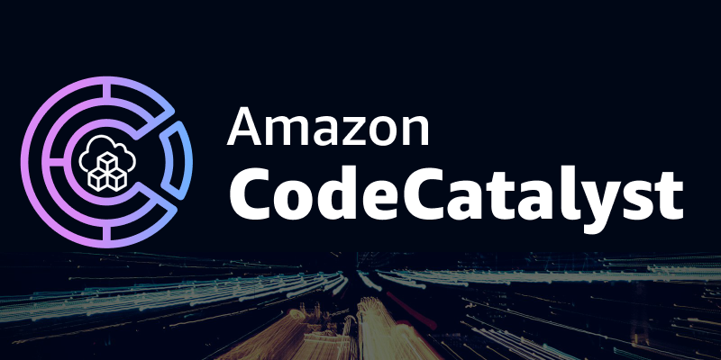

<p align="center">
  <a href="https://dev.to/vumdao">
    
  </a>
</p>
<h1 align="center">
  <div><b>Bootstrapping AWS CDK Automation With Amazon CodeCatalyst</b></div>
</h1>

## Abstract
- A step-by-step guide on establishing an AWS CDK setup alongside Amazon CodeCatalyst from the ground up, enabling the creation of a comprehensive CI/CD pipeline for your infrastructure.
- AWS CDK is fantastic for overseeing your entire infrastructure as code, but when multiple developers are involved in modifying the infrastructure, the situation can become chaotic without a proper mechanism like a CI/CD pipeline. Absence of such a system makes coordinating and communicating changes to the infrastructure a challenging task, and this challenge amplifies as more individuals participate in the modification process.
- This tutorial will guide you through setting up a CI/CD pipeline using Amazon CodeCatalyst and AWS CDK for building To-Do web application

  

## Table Of Contents
 * [Setting up a CodeCatalyst Project, Repo, and Environment](#Setting-up-a-CodeCatalyst-Project,-Repo,-and-Environment)
 * [Design workflows](#Design-workflows)
 * [Source code and CDK stacks](#Source-code-and-CDK-stacks)
 * [Push source code to repo](#Push-source-code-to-repo)
 * [Workflows Runs](#Workflows-Runs)
 * [Conclusion](#Conclusion)

---

## 🚀 **Setting up a CodeCatalyst Project, Repo, and Environment** <a name="Setting-up-a-CodeCatalyst-Project,-Repo,-and-Environment"></a>
1. Login to CodeCatalyst and go to your Space (Create one if you don't have)
2. Create a project from scratch

  

3. Create repository to store code and workflows of the project

  

  

4. Create CICD `Environments` which associates to AWS account for deploying our infrastructure.

  

5. Create IAM role for codecatalyst to consume during running workflows. It should be already created while you create the Space or you can customize the others

  

## 🚀 **Design workflows** <a name="Design-workflows"></a>
- Workflows directory
  ```
  .codecatalyst
  └── workflows
      └── main_fullstack_workflow.yaml
  ```

- Workflows is triggered by `PUSH` of branch `main` and includes following `Actions`
  ```
  Triggers:
    - Branches:
        - main
      Type: PUSH
  ```

  1. `FrontendBuildAndPackage` build react app, target `build` which is shared to cross-actions by `Artifacts` of `Outputs`
    ```
    FrontendBuildAndPackage:
      Identifier: aws/build@v1
      Inputs:
        Sources:
          - WorkflowSource
      Outputs:
        Artifacts:
          - Name: frontend
            Files:
              - "**/*"
      Configuration:
        Steps:
          - Run: cd static-assets/frontend
          - Run: npm install
          - Run: echo "REACT_APP_SERVICE_URL=/api/todos" > ".env"
          - Run: npm run build
    ```

  2. `FrontendTest` Test frontend code
    ```
    FrontendTest:
        Identifier: aws/managed-test@v1
        Inputs:
          Sources:
            - WorkflowSource
        Outputs:
          AutoDiscoverReports:
            IncludePaths:
              - frontend/**/*.xml
            ExcludePaths:
              - frontend/node_modules/**/*
            ReportNamePrefix: AutoDiscovered
            Enabled: true
            SuccessCriteria:
              PassRate: 100
        Configuration:
          Steps:
            - Run: cd static-assets/frontend
            - Run: npm install
            - Run: npm test -- --coverage --watchAll=false;
    ```

  3. `CDKBootstrapAction` Run `cdk bootstrap` for the region of the account with latest CDK version. This action depends on `FrontendTest` and `FrontendBuildAndPackage`
    ```
    CDKBootstrapAction:
      Identifier: aws/cdk-bootstrap@v1
      Configuration:
        Region: us-east-1
        CdkCliVersion: latest
      Environment:
        Name: default_environment
        Connections:
          - Name: "123456789012"
            Role: CodeCatalystWorkflowDevelopmentRole-simflexcloud
      DependsOn:
        - FrontendTest
        - FrontendBuildAndPackage
    ```

  4. `CDKDeploy` Download build target of `FrontendBuildAndPackage` and trigger `cdk deploy`, this action depends on `CDKBootstrapAction`. Here I don't use the defined action `aws/cdk-deploy@v1` of CodeCatalyst because I'd like to use `projen` and `pnmp` in CDK and handle copying frontend target build
    ```
    CDKDeploy:
      Identifier: aws/build@v1
      Inputs:
        Artifacts:
          - frontend
      Outputs:
        AutoDiscoverReports:
          IncludePaths:
            - "**/*"
          ExcludePaths:
            - "*/.codecatalyst/workflows/*"
          ReportNamePrefix: AutoDiscovered
          Enabled: true
      Configuration:
        Steps:
          - Run: cp -r static-assets/frontend/build static-assets/cdkStack/src/lib/frontend/
          - Run: cd static-assets/cdkStack
          - Run: npm install -g pnpm
          - Run: pnpm i --no-frozen-lockfile
          - Run: export CDK_DEPLOY_ACCOUNT=123456789012
          - Run: export CDK_DEPLOY_REGION=us-east-1
          - Run: pnpm dlx projen deploy --all --require-approval never
      Environment:
        Name: default_environment
        Connections:
          - Name: "123456789012"
            Role: CodeCatalystWorkflowDevelopmentRole-simflexcloud
      DependsOn:
        - FrontendTest
        - FrontendBuildAndPackage
    ```

- Use EC2 compute type for CodeCatalyst workflows
  ```
  Compute:
    Type: EC2
    Fleet: Linux.x86-64.Large
  ```

## 🚀 **Source code and CDK stacks** <a name="Source-code-and-CDK-stacks"></a>
- Structure
  - `cdkStack` Define CDK stacks and use `projen` for configuration management as well as `pnpm`
  - `frontend` Frontend react app

  ```
  static-assets
  ├── cdkStack
  │   │   ├── LICENSE
  │   │   ├── README.md
  │   │   ├── cdk.json
  │   │   ├── package.json
  │   │   ├── src
  │   │   │   ├── bin
  │   │   │   │   └── main.ts
  │   │   │   ├── lib
  │   │   │   │   ├── backend
  │   │   │   │   │   ├── lambda
  │   │   │   │   │   │   ├── CorsAPIGatewayProxyResult.ts
  │   │   │   │   │   │   ├── Todo.ts
  │   │   │   │   │   │   ├── addTodo.ts
  │   │   │   │   │   │   ├── deleteTodo.ts
  │   │   │   │   │   │   ├── getTodo.ts
  │   │   │   │   │   │   ├── getTodos.ts
  │   │   │   │   │   │   └── updateTodo.ts
  │   │   │   │   │   └── todo-api-stack.ts
  │   │   │   │   └── frontend
  │   │   │   │       ├── build
  │   │   │   │       ├── constants.ts
  │   │   │   │       └── frontend-stack.ts
  │   │   │   └── main.ts
  │   │   ├── test
  │   │   │   └── todo-api.test.ts
  │   │   ├── tsconfig.dev.json
  │   │   └── tsconfig.json
  │   └── frontend
  │       ├── README.md
  │       ├── babel.config.js
  │       ├── jest.config.js
  │       ├── package.json
  │       ├── public
  │       │   ├── index.html
  │       │   ├── manifest.json
  │       │   └── robots.txt
  │       ├── src
  │       │   ├── App.css
  │       │   ├── App.test.tsx
  │       │   ├── App.tsx
  │       │   ├── index.css
  │       │   ├── index.tsx
  │       │   ├── react-app-env.d.ts
  │       │   ├── reportWebVitals.ts
  │       │   ├── setupTests.ts
  │       │   ├── to-do.api.ts
  │       │   └── to-do.types.ts
  │       └── tsconfig.json
  ├── tsconfig.dev.json
  ├── tsconfig.json
  └── yarn.lock
  ```

## 🚀 **Push source code to repo** <a name="Push-source-code-to-repo"></a>
- Init the repo and add repo URL which is created from the above as `origin`

  

  ```
  ➜  git init
  Initialized empty Git repository in /Users/vudao/workspace/codecatalyst/cdk-todo-web-app/.git/
  ➜  git remote add origin https://vumdao@git.us-west-2.codecatalyst.aws/v1/simflexcloud/cdk-todo-web-app/cdk-todo-web-app
  ➜  git branch --set-upstream-to=origin/main main
  branch 'main' set up to track 'origin/main' by rebasing.
  ➜  git pull
  ➜  git add .
  ➜  git commit -m "Init commit"
  ➜  git push origin main
  ```

## 🚀 **Workflows Runs** <a name="Workflows-Runs"></a>
- When the commit is pushed to the `main` branch, CodeCatalyst CI/CD triggers the workflows

  

  

- The `CDKDeploy` triggers cloudformation to create AWS resources

  

- After the workflows done, we now have the To-Do Web app UI

  

## 🚀 **Conclusion** <a name="Conclusion"></a>
Congratulations! You've successfully bootstrapped and initialized AWS CDK with CodeCatalyst, and you can now deploy infrastructure changes or update frontend/backend using a pull request workflow.

---
<h3 align="center">
  <a href="https://dev.to/vumdao">:stars: Blog</a>
  <span> · </span>
  <a href="https://github.com/vumdao/codecatalyst-cdk-todo-web-app">Github</a>
  <span> · </span>
  <a href="https://stackoverflow.com/users/11430272/vumdao">stackoverflow</a>
  <span> · </span>
  <a href="https://www.linkedin.com/in/vu-dao-9280ab43/">Linkedin</a>
  <span> · </span>
  <a href="https://www.linkedin.com/groups/12488649/">Group</a>
  <span> · </span>
  <a href="https://www.facebook.com/CloudOpz-104917804863956">Page</a>
  <span> · </span>
  <a href="https://twitter.com/VuDao81124667">Twitter :stars:</a>
</h3>