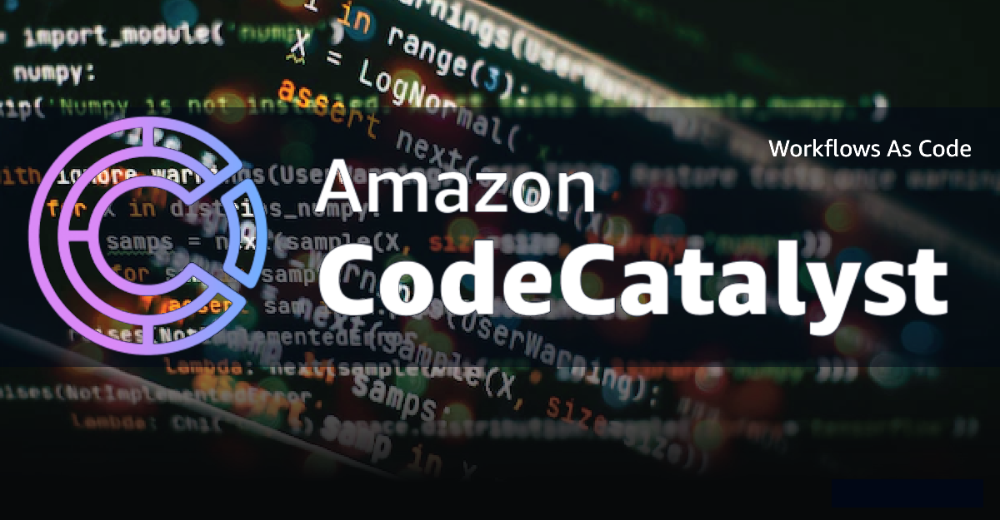

<p align="center">
  <a href="https://dev.to/vumdao">
    
  </a>
</p>
<h1 align="center">
  <div><b>Empowering Amazon CodeCatalyst: Workflows as Code with CodeCatalyst-Blueprints</b></div>
</h1>

## Abstract
- This blog introduces how to optimize workflow management within the Amazon ecosystem using [codecatalyst-blueprints](https://github.com/aws/codecatalyst-blueprints). By employing a `blueprint.ts` file, developers can succinctly express workflows as code, promoting readability and collaboration without CodeCatalyst Enterprise tier

## Table Of Contents
 * [Blueprints introduction](#Blueprints-introduction)
 * [Init Blueprint project using Projen](#Init-Blueprint-project-using-Projen)
 * [Write blueprint.ts to build worksflow](#Write-blueprint.ts-to-build-worksflow)
 * [Generate workflow yaml file](#Generate-workflow-yaml-file)
 * [Workflows Runs](#Workflows-Runs)
 * [Conclusion](#Conclusion)

---

## 🚀 **Blueprints introduction** <a name="Blueprints-introduction"></a>
- Blueprints are code generators used to create and maintain projects in Amazon CodeCatalyst. You can build your own blueprint (Custom Blueprints) today by upgrading to the CodeCatalyst Enterprise tier. An integral aspect of Blueprints involves workflow generation. Disregarding the CodeCatalyst Enterprise tier, we can utilize this feature to create CodeCatalyst workflows as code, utilizing the preferred programming language, such as Typescript.

## 🚀 **Init Blueprint project using Projen** <a name="Init-Blueprint-project-using-Projen"></a>
- We cannot use [Projen](https://projen.io) to init a blueprint project as AWS CDK or CDK8S, but we can do a trick by init TypeScript project and then update `.projenrc.ts` as [ProjenBlueprint](https://github.com/aws/codecatalyst-blueprints/blob/main/packages/blueprints/blueprint/.projenrc.ts)

- While we cannot directly use [Projen](https://projen.io) to initialize a blueprint project such as AWS CDK or CDK8S, we can employ a workaround. Initialize a TypeScript project first, and then update the `.projenrc.ts` file using [`ProjenBlueprint`](https://github.com/aws/codecatalyst-blueprints/blob/main/packages/blueprints/blueprint/.projenrc.ts)

- To initialize a TypeScript project using Projen, you can use the following command
  ```
  ➜  projen new typescript --no-git --projenrc-ts --github false --dev-deps "@amazon-codecatalyst/blueprint-util.projen-blueprint" "@amazon-codecatalyst/blueprint-util.cli"
  👾 Project definition file was created at /private/tmp/blueprint/.projenrc.ts
  👾 Installing dependencies...
  👾 install | yarn install --check-files
  yarn install v1.22.19
  ```

- Override the `.projenrc.ts` with the following code
  ```
  import { ProjenBlueprint } from '@amazon-codecatalyst/blueprint-util.projen-blueprint';

  const project = new ProjenBlueprint({
    name: 'cdk-todo-web-app',
    defaultReleaseBranch: 'main',
    projenrcTs: true,
    sampleCode: false,
    github: false,
    tsconfig: {
      compilerOptions: {
        esModuleInterop: true,
        noImplicitAny: false,
      },
    },
    deps: [
      'projen',
      '@amazon-codecatalyst/blueprints.blueprint',
      '@amazon-codecatalyst/blueprint-component.workflows',
      '@amazon-codecatalyst/blueprint-component.source-repositories',
      '@amazon-codecatalyst/blueprint-component.dev-environments',
      '@amazon-codecatalyst/blueprint-component.environments',
    ],
    devDeps: [
      'ts-node@^10',
      'typescript',
      '@amazon-codecatalyst/blueprint-util.projen-blueprint',
      '@amazon-codecatalyst/blueprint-util.cli',
    ],
  });

  project.synth();
  ```

- Then run `projen` to update the `package.json`, `.projen`, and other files managed by Projen
  ```
  ➜  projen
  👾 default | ts-node --project tsconfig.dev.json .projenrc.ts
  👾 Installing dependencies...
  👾 install | yarn install --check-files
  yarn install v1.22.19
  ```

## 🚀 **Write `blueprint.ts` to build worksflow** <a name="Write-`blueprint.ts`-to-build-worksflow"></a>
- If you've utilized CodeCatalyst custom blueprints, you are likely familiar with blueprint.ts, which contains code for generating UI options, environment settings, source repository configurations, and workflows. When creating a custom blueprint, these elements are automatically generated. However, if your goal is to leverage the CI/CD capabilities of the CodeCatalyst workspace without requiring all components, you specifically need the workflow generation part.

- In short, the `blueprint.ts` file encompasses the following elements:
  1. Source repository - serves as a reference point for workflow configurations
    ```
    const repository = new SourceRepository(this, {
      title: "cdk-todo-web-app",
    });
    ```

  2. Environment - Where we define the CI/CD environment, including the connection to the AWS account.
    ```
    const environment = new Environment(this, {
      name: "default_environment",
      environmentType: "DEVELOPMENT",
      description: "Blueprint environment",
      awsAccount: {
        cdkRole: { name: CDK_DEFAULT_ROLE },
        id: CDK_DEFAULT_ACCOUNT,
        name: CDK_DEFAULT_ACCOUNT,
      },
    });
    ```

  3. Workflow Actions
    - An Action includes the following major components
      ```
      export interface ActionProps {
        actionName: string;
        identifier: string;
        steps: string[];
        environment?: WorkflowEnvironment;
        dependancies?: string[];
        inputs?: { [key: string]: any[] };
        outputs?: { [key: string]: any };
      }
      ```

    - A wrapper function that generates a workflow Action based on the interface
      ```
      /**
      * Generate an action for the workflow
      * @param props ActionProps
      * @returns Action
      */
      export function GenerateAction(props: ActionProps) {
        return {
          [props.actionName]: {
            Identifier: props.identifier,
            Inputs: props.inputs ? props.inputs : { Sources: ["WorkflowSource"] },
            Outputs: props.outputs
              ? props.outputs
              : {
                  AutoDiscoverReports: {
                    IncludePaths: ["**/*"],
                    ExcludePaths: ["*/.codecatalyst/workflows/*"],
                    ReportNamePrefix: "AutoDiscovered",
                    Enabled: true,
                  },
                },
            Configuration: {
              Steps: props.steps.map((step) => ({ Run: step })),
            },
            Environment: props.environment,
            DependsOn: (props.dependancies) ? props.dependancies : undefined,
          },
        };
      }
      ```

    - We will have following actions
      1. `FrontendBuildAndPackage`
      2. `FrontendTest`
      3. `CDKBootstrapAction`
      4. `CDKDeploy`

  4. WorkflowBuilder - Responsible for defining the workflow name, compute type, trigger type, and the required actions
    ```
    const workflowBuilder = new WorkflowBuilder(this, {
      Name: "main_fullstack_workflow",
      Compute: {
        Type: ComputeType.EC2,
        Fleet: ComputeFleet.LINUX_X86_64_LARGE,
      },
      Triggers: [
        {
          Branches: ["main"],
          Type: TriggerType.PUSH,
        },
      ],
      Actions: {
        ...frontendBuildAndPackage,
        ...frontendTest,
        ...cdkBootstrapAction,
        ...cdkDeploy,
      },
    });
    ```

  5. Workflow - Collects all WorkflowBuilder instances and incorporates them into the source code repository
    ```
    new Workflow(this, repository, workflowBuilder.getDefinition());
    ```

## 🚀 **Generate workflow yaml file** <a name="Generate-workflow-yaml-file"></a>
- Run `yarn blueprint:synth` (This script is from `package.json`)
  ```
  ➜  cdk-todo-web-app git:(main) ✗ yarn blueprint:synth
  yarn run v1.22.19
  $ blueprint drive-synth --blueprint ./ --outdir ./synth --default-options ./src/defaults.json --additional-options ./src/wizard-configurations $*
  [1706372494181] INFO (5048 on Daos-MBP): Running in quick mode. Run this command with --cache to emulate the wizard
  [1706372494192] INFO (5048 on Daos-MBP): ==========================================
  [1706372494192] INFO (5048 on Daos-MBP): [00.synth.defaults.json]
  [1706372494192] INFO (5048 on Daos-MBP): npx blueprint synth --options merge[./src/defaults.json,./src/defaults.json] --blueprint ./ --outdir synth/00.synth.defaults.json/proposed-bundle
  [1706372494192] INFO (5048 on Daos-MBP): ==========================================
  ===== Starting synthesis =====
  options:  {}
  outputDir:  synth/00.synth.defaults.json/proposed-bundle
  Instantiations location not specified
  running synthesis into /codecatalyst/cdk-todo-web-app/synth/00.synth.defaults.json/proposed-bundle/src/cdk-todo-web-app
  ===== Ending synthesis =====
  ✨  Done in 2.10s.
  ```

- We have the generated files in `synth/00.synth.defaults.json/proposed-bundle` and we have our workflow YAML file is located at `synth/00.synth.defaults.json/proposed-bundle/src/cdk-todo-web-app/.codecatalyst/workflows/main_fullstack_workflow.yaml`
  ```
  ➜  cdk-todo-web-app git:(main) ✗ tree synth/00.synth.defaults.json/proposed-bundle/src/cdk-todo-web-app/.codecatalyst
  synth/00.synth.defaults.json/proposed-bundle/src/cdk-todo-web-app/.codecatalyst
  └── workflows
      └── main_fullstack_workflow.yaml

  2 directories, 1 file
  ```

- Copy the YAML file
  ```
  ➜  cdk-todo-web-app git:(main) ✗ cp synth/00.synth.defaults.json/proposed-bundle/src/cdk-todo-web-app/.codecatalyst/workflows/main_fullstack_workflow.yaml .codecatalyst/workflows/main_fullstack_workflow.yaml
  ```

- Now we can push the code to the repository and check the workflow run

  

## 🚀 **Conclusion** <a name="Conclusion"></a>
- Congratulations! You have successfully generated CodeCatalyst workflows as code using [codecatalyst-blueprints](https://github.com/aws/codecatalyst-blueprints) without enabling the CodeCatalyst Enterprise tier.
- You can create an Action to automatically generate and update the workflow YAML file by pushing a new commit to the main branch, reflecting changes from the `blueprint.ts` file.

---

<h3 align="center">
  <a href="https://dev.to/vumdao">:stars: Blog</a>
  <span> · </span>
  <a href="https://github.com/vumdao/cdk-todo-web-app">Github</a>
  <span> · </span>
  <a href="https://stackoverflow.com/users/11430272/vumdao">stackoverflow</a>
  <span> · </span>
  <a href="https://www.linkedin.com/in/vu-dao-9280ab43/">Linkedin</a>
  <span> · </span>
  <a href="https://www.linkedin.com/groups/12488649/">Group</a>
  <span> · </span>
  <a href="https://www.facebook.com/CloudOpz-104917804863956">Page</a>
  <span> · </span>
  <a href="https://twitter.com/VuDao81124667">Twitter :stars:</a>
</h3>